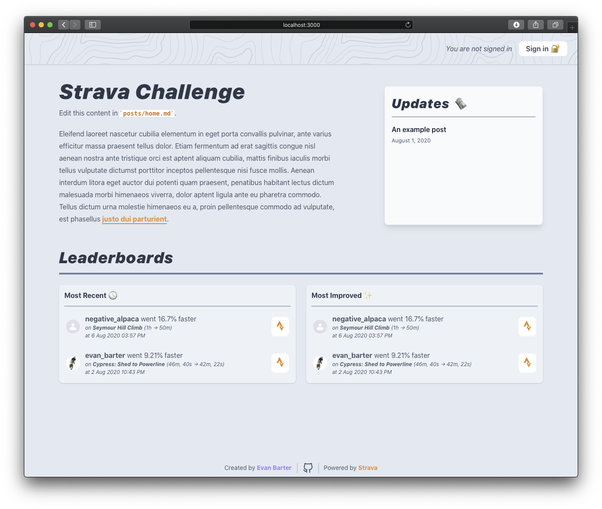
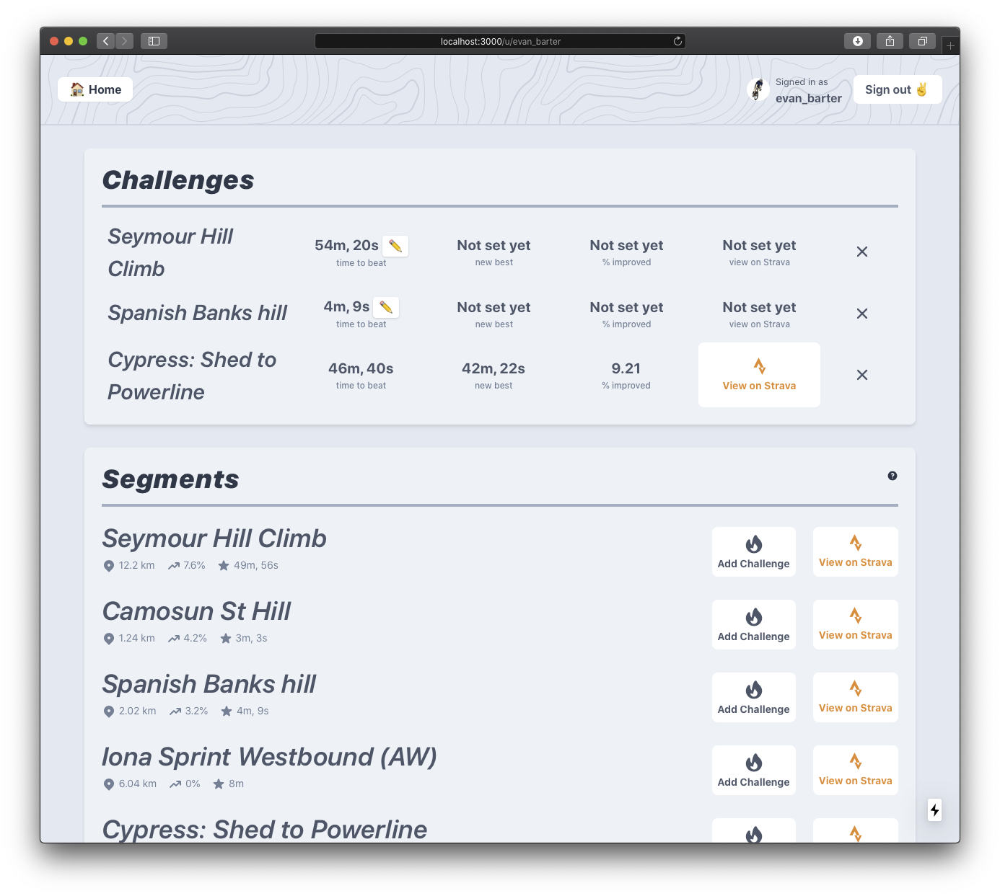
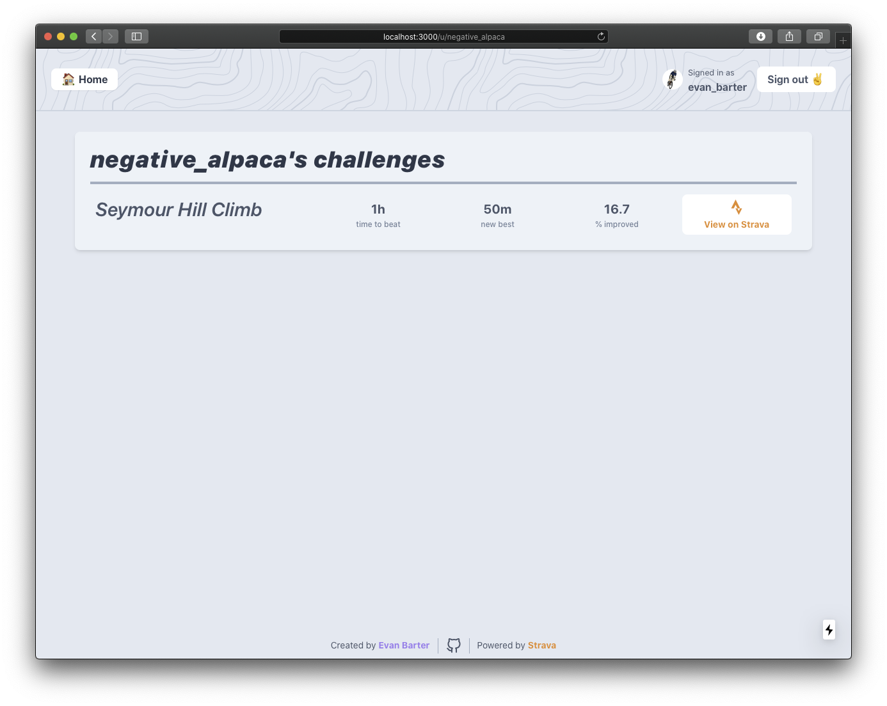

# Strava Challenge

A site that allows Strava users to set a benchmark or challenge times on a segment, find other users with a similar benchmark, and record successful attempts to beat their benchmark time, backed by Strava's API.

## Requirements

* **Node.js** version 10.13 or newer.
* **MySQL** version 5.7 or newer.

## How to use

After checking out the repo, install dependencies.

```bash
npm install
# or
yarn
```

### Set up the environment file

```bash
cp .env.local.example .env.local
```

If you're developing locally, you should leave the NEXTAUTH_URL and NEXT_PUBLIC_URL variables to their default value. You should also enter the credentials for the MySQL database you wish to use.

### Set up a Strava app

Visit [this page](https://www.strava.com/settings/api) (https://www.strava.com/settings/api) and set up a new API Application. Strava appears to be hiding this page from view, by default. You should use `localhost:3000` as the _Authorization Callback Domain_ if you're setting up a new app in development.

Make note of your client ID and client secret. These will need to be added to your `.env.local` file.

### Load the database schema

```bash
mysql -u<your MySQL username> -p <your MySQL database> < schema.sql
```

Enter your MySQL password when prompted.

### Start the development server

```bash
npm run dev
# or
yarn dev
```

### Register a webhook URL for your app

**Note!** This step needs to be completed with an instance of this app that is publically accessible via the Internet, so that Strava may begin to send activity data via webhooks. It will not work when the app is running in the `localhost:3000` development server.

```bash
curl -X POST https://www.strava.com/api/v3/push_subscriptions \
    -F client_id=<your Strava app client ID> \
    -F client_secret=<your Strava app client secret> \
    -F 'callback_url=https://<your domain>/api/strava' \
    -F 'verify_token=STRAVA'
```

## Notes

This is my first attempt at developing an app with the [Next.js](https://nextjs.org) framework. It was also an opportunity to refresh myself with [React](https://reactjs.org), after not having used it for a number of years. As such, it should not be considered as an idiomatic example of how to use these technologies, but rather as an open-source learning example.

The frontend is styled with [Tailwind CSS](https://tailwindcss.com) and also uses [Hero Patterns](https://www.heropatterns.com), [Hero Icons](https://github.com/refactoringui/heroicons) and [Feather Icons](https://github.com/feathericons/feather).

## Screenshots

### Home


### Logged in user profile page


### Viewing another user

